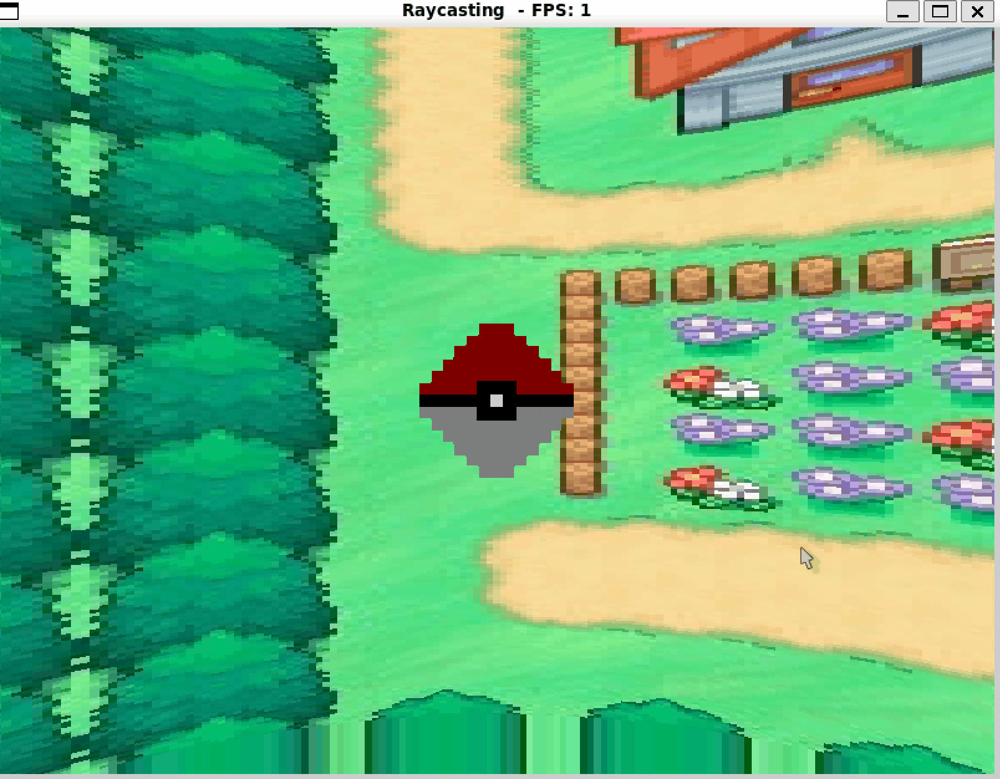

# cg-rt-2023

## Descripcion
 Creación de un diorama utilizando cubos texturizados y agregando los efectos de raytracing vistos en clase.

### Navegacion de la pokebola

## Dependencias
- SLD2: Libreria utilizada para crear ventanas y renderizar graficas.
- GLM: Libreria matematica para operaciones con vectores y matrices.

## Criterios utilizados
* [30 puntos] Criterio subjetivo. Por qué tan compleja sea su escena
* [20 puntos] Criterio subjetivo. Por qué tan visualmente atractiva sea su escena
* [20 puntos] Por implementar rotación en su diorama y dejar que la cámara se acerque y aleje
* [5 puntos] por cada material diferente que implementen, para un máximo de 5
    * Para que el material cuente, debe tener su propia textura, y sus propios parámetros para albedo, specular, transparencia y reflectividad
* [10 puntos] por implementar refracción en al menos uno de sus materiales (debe tener sentido contextual en su escena)
* [5 puntos] por implementar reflexión en al menos uno de sus materiales
* [20 puntos] por implementar un skybox para su material
